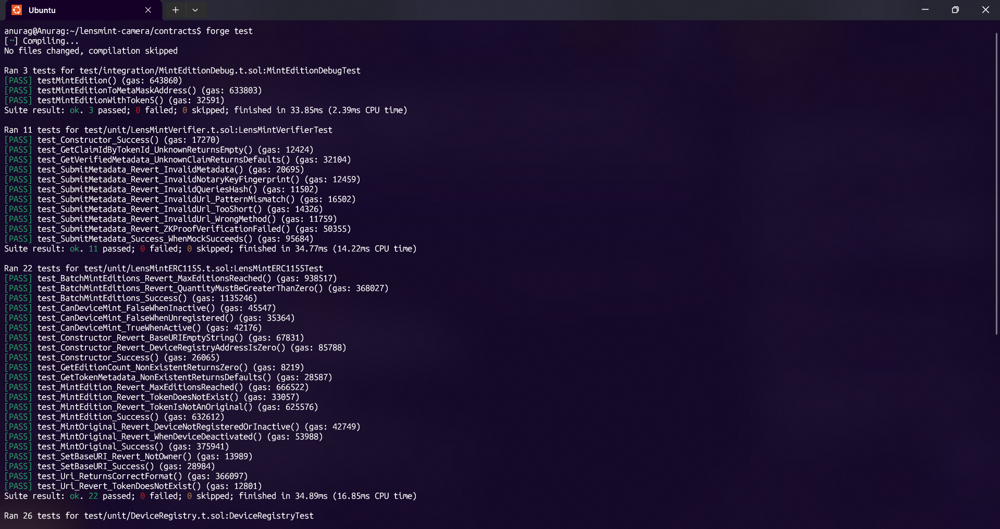
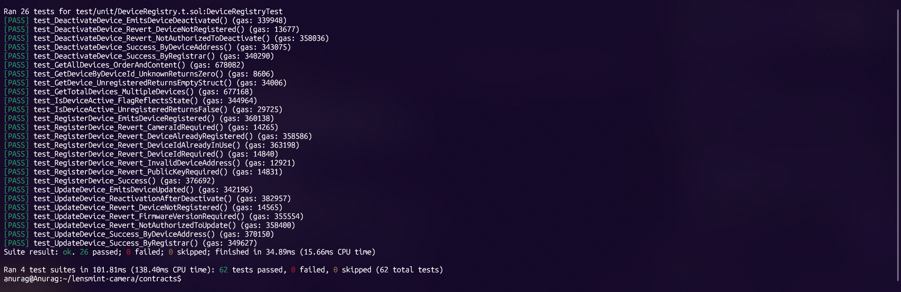

# LensMint Contract Tests

Tests are split into **unit** and **integration** folders.

## Layout

| Folder         | Purpose |
|----------------|---------|
| `unit/`        | Single-contract tests with mocks; fast, no cross-contract flow. |
| `integration/` | Multi-contract flows (e.g. DeviceRegistry + LensMintERC1155).   |

## Running tests

```bash
# All tests
forge test

# Unit only
forge test --match-path "test/unit/*.sol"

# Integration only
forge test --match-path "test/integration/*.sol"

# One contract
forge test --match-contract DeviceRegistryTest
forge test --match-contract LensMintERC1155Test
forge test --match-contract LensMintVerifierTest
forge test --match-contract MintEditionDebugTest
```

## Files

- **unit/DeviceRegistry.t.sol** – DeviceRegistry (register, update, deactivate, getters, events).
- **unit/LensMintERC1155.t.sol** – LensMintERC1155 (constructor, mintOriginal, mintEdition, batchMintEditions, uri, setBaseURI, canDeviceMint).
- **unit/LensMintVerifier.t.sol** – LensMintVerifier (constructor, submitMetadata validation, getters) using `MockRiscZeroVerifier`.
- **integration/MintEditionDebug.t.sol** – Full flow: register device → mint original → mint edition(s).


## Test results

The latest full `forge test` run (unit + integration) passed successfully. Summary screenshots are stored under `docs/images`:


